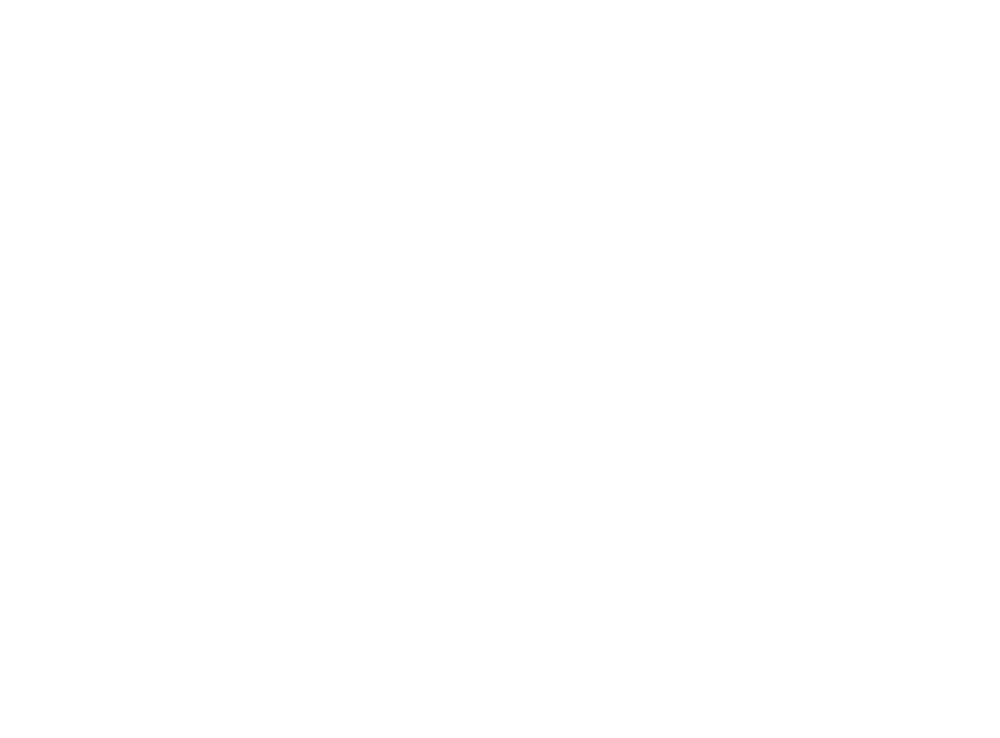
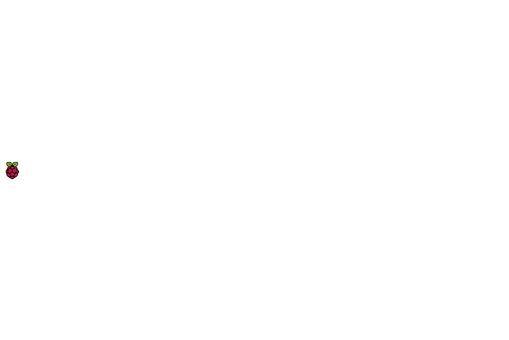
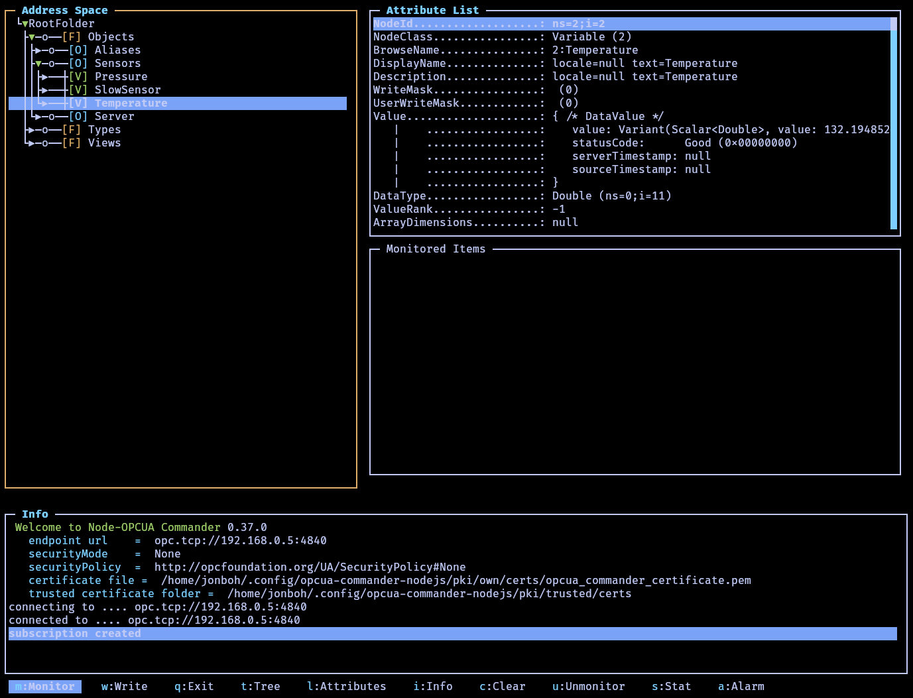
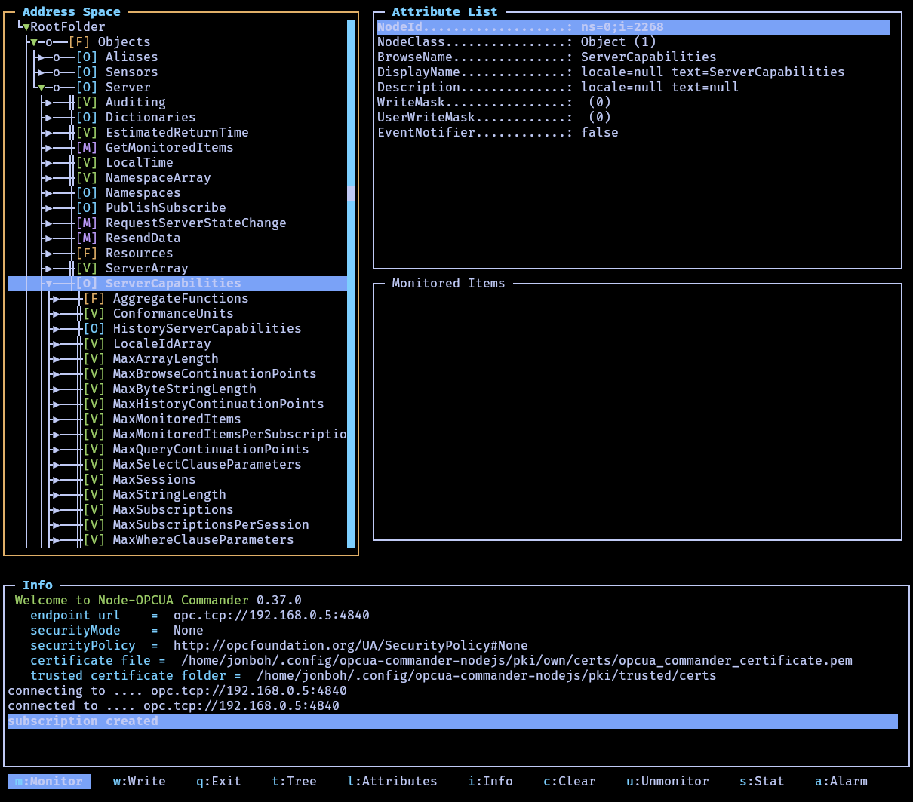
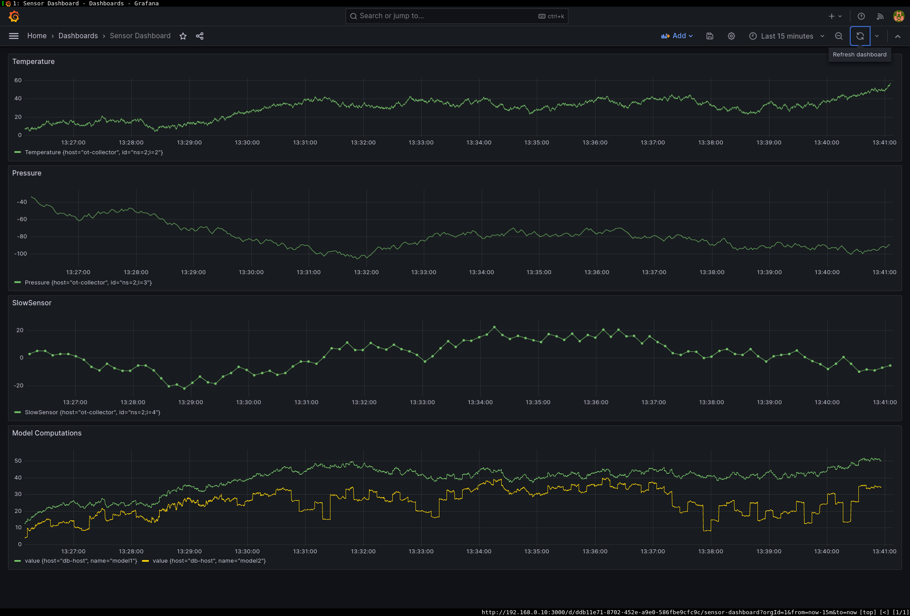

# Declarative, Reproducible, Free and Open Source Data Pipelines


# Declarative, Reproducible, Free and Open Source Data Pipelines
- You can find the source to reproduce this project in your own hardware here:
    - [https://github.com/jonboh/declarative_data_pipelines](https://github.com/jonboh/declarative_data_pipelines)

# What can you expect in a modern enterprise technology wise?
- IT Domination

- Ethernet + TCP/IP (almost) everywhere

- HTTP APIs (almost) everywhere

- OPC-UA on the OT layer

- MQTT on some hardware

- IaC to provide reliability and flexibility


# Data Acquisition Overview
- OT-Devices

- Data Collector

- Data Storage

- Data Streaming

- Data Consumers

- Data Visualization


# Data Acquisition Overview


# Data Acquisition Overview
- OT-Level -> OPC-UA Server

- Data Collector -> Telegraf Agent

- Data Storage -> InfluxDB

- Data Streaming -> Apache Kafka

- Data Consumers -> Mock Model

- Data Visualization -> Grafana

# What we are going to build
{height=80%}

# Data Source: OPC UA Server
- Nodes
    - Variables
    - Types
    - Server introspection

- Polling
    - Uniform sampling

- Pub/Sub
    - Lower resource consumption
    - Some extra complexity

# Data Source: OPC UA Server Variables


# Data Source: OPC UA Server Capabilities



# What we are going to build
- Data Collector: Telegraf
{height=80%}

# Data Collection: Telegraf
- Distributed collection

- Multiple input/output plugins
    - Input
        - OPC-UA
        - Modbus
        - Files
        - and more...
    - Output
        - InfluxDB
        - SQL Databases
        - Kafka
        - and more...
    - Processors
        - Transformations
        - Filters

# What we are going to build
- DB: InfluxDB
{height=80%}

# Data Storage: InfluxDB
- Timeseries Database

- High performance and scalable
    - Compression


# What we are going to build
- Data Streaming & Data Consumers: Apache Kafka & Clients
{height=80%}

# Data Streaming: Kafka
- Distributed Data Streaming
    - Continuous transfer and processing of data in real-time as it is generated or received.

- Fault-Tolerant

- Scalable

- High Throughput

# What we are going to build
- Data Visualization: Grafana
{height=80%}

# Data Visualization: Grafana
- Dashboarding Platform

- Lots of plugins

- Wide Data Source support


# Data Visualization: Grafana


# Why Declarative and Reproducible?
- Imperative system are black boxes once set up.
    - You need to worry that operations are `idempotent` `f(f(x)) = f(x)`
    - Given a system you need to probe each configuration to retrieve its state

- Declarative system are (mostly) white boxes.
    - Config files are representations of the systems

- Declarative != Reproducible
    - Declarative -> IaC
    - Reproducible: You always get the same result for a given set of configurations

- Reproducible systems allow for complete production replication in the development environment
    - Dev == Test == Prod

# What we are going to build
- So many DSLs
{height=80%}

# Nix


- One language to configure them all.
    - and in reproducibility bind them.


# Nix Flakes
- Generate reproducible packages and system configurations

- `flake.nix`
    - `configuration.nix` -> split for convenience
        - Defines the configuration of an output system

- `flake.lock`
    - Locks the hashes of the inputs


# Flakes Inputs
- Inputs will usually be package repositories
```nix
# ./flake.nix
{
  inputs = {
    nixpkgs.url = "nixpkgs/nixos-23.11";
    nixos-generators = {
      url = "github:nix-community/nixos-generators";
      inputs.nixpkgs.follows = "nixpkgs";
    };
    sops-nix = {
      url = "github:Mic92/sops-nix";
      inputs.nixpkgs.follows = "nixpkgs";
    };
  };
  #..
}
```

# Flakes Outputs
- Outputs:
    - Packages
    - System configurations
    - Development shells
```nix
{
  outputs = { self, nixpkgs, nixos-generators, sops-nix, ... }:
    let
      lib = nixpkgs.lib;
      pkgs = import nixpkgs {
        inherit system;
      };
      raspberry_pkgs = import nixpkgs {
        system = "aarch64-linux";
      };
    in {
      packages.x86_64-linux = {
        "collector@vbox" = nixos-generators.nixosGenerate {
          system = "x86_64-linux";
          inherit pkgs;
          # ..
          modules = [
            ./collect_agent/configuration.nix
            # ..
          ];
          format = "virtualbox";
        };
      nixosConfigurations = {
        "opc@raspberry" = lib.nixosSystem {
          system = "aarch64-linux";
          pkgs = raspberry_pkgs;
          # ..
          modules = [
            ./opc/configuration.nix
            # ..
          ]; }; }; }; }
```

# What we are going to build
- Common configuration
{height=80%}

# Nix: Common configuration for all systems
```nix
# ./common/configuration.nix
{defaultGateway, ...}: {
  networking = {
    firewall.enable = true;
    useDHCP = false;
    inherit defaultGateway;
    nameservers = [ "208.67.222" "208.67.220.220" ];
    networkmanager.enable = true;
  };

  # Users and groups
  users.mutableUsers = false;
  users.users.admin = {
    isNormalUser = true;
    extraGroups = [ "wheel" ];
    openssh.authorizedKeys.keys = [
      # you should put here your ssh public key.
      "ssh-ed25519 AAAAC3NzaC1lZDI1NTE5AAAAIAninVG6bOxD7bOi7od3WJJvPAV7DEiejNqHXrRqzdKW jon.bosque.hernando@gmail.com"
    ];
  };

  # Enable the SSH daemon for remote management
  services.openssh = {
    enable = true;
    allowSFTP = true;
    openFirewall = true;
    settings = {
      PasswordAuthentication = false;
      KbdInteractiveAuthentication = false;
      PermitRootLogin = "prohibit-password";
    };
  };
}
```

# Nix: Data Source - OPC-UA Server
```nix
# ./opc/configuration.nix
{ pkgs, ... }: {
  imports = [ ./opc_server.nix ];
  networking = {
    hostName = "opc-server";
    firewall.allowedTCPPorts = [ 4840 ];
    interfaces = {
      eth0 = {
        ipv4.addresses = [{
          address = "192.168.0.5";
          prefixLength = 24; # Equivalent to a netmask of 255.255.255.0
        }];
      };
    };
  };

  services.opc_server = {
    enable = true;
    scriptPath = ./server.py;
  };
}
```

# What we are going to build
- Data Collector: Telegraf
{height=80%}

# Nix: Data Collector - Telegraf Agent Inputs
```nix
{ collector_ip, db_ip, ... }: {
  # networking omitted
  imports = [ ../common/sops.nix ../common/telegraf-environment.nix ];

  users.users.telegraf = { extraGroups = [ "secret-readers" ]; };

  services.telegraf = {
    enable = true;
    extraConfig = {
      inputs = {
        opcua_listener = {
          name = "opc_server";
          endpoint = "opc.tcp://${opc_ip}:4840";
          security_policy = "None";
          security_mode = "None";
          nodes = [
            {
              name = "Pressure";
              namespace = "2";
              identifier_type = "i";
              identifier = "3";
            }
            {
              name = "SlowSensor";
              namespace = "2";
              identifier_type = "i";
              identifier = "4";
            }
            {
              name = "Temperature";
              namespace = "2";
              identifier_type = "i";
              identifier = "2";
            }
          ];
        };
      };
    };
  };
  # ...
}
```

# Nix: Data Collector - Telegraf Agent Outputs
```nix
{ collector_ip, db_ip, ... }: {
  # ...
  services.telegraf = {
    environmentFiles = [ "/run/secrets_derived/influxdb_token.env" ];
    extraConfig = {
      outputs = {

        file = { files = [ "stdout" ]; };

        kafka = {
          brokers = [ "${db_ip}:9092" ];
          topic = "opc";
          data_format = "json";
          json_timestamp_units = "1ns";
        };

        influxdb_v2 = [{
          urls = [ "http://${db_ip}:8086" ];
          token = "$INFLUXDB_TOKEN";
          organization = "devorg";
          bucket = "dev";
        }];

      };
    };
  };
}
```

# Secret Management
- Nix copies all referenced files to `/nix/store` which is readable by all users

- SOPS
    - `age` keys
    - Key Management Systems

# Secret Management
- Encrypted secrets are made available at runtime
```json
{
  "data": "ENC[AES256_GCM,data:q6rpCl5nVBUI,iv:SX9zne3mf6Xt4lkJIeW1AWt+vu0VmXgxgG0dXE17nZo=,tag:OYbwE3yDLSVlnwFVO8aWlQ==,type:str]",
  "sops": {
    "kms": null,
    "gcp_kms": null,
    "azure_kv": null,
    "hc_vault": null,
    "age": [
      {
        "recipient": "age1a4zrwycxteq0nuvq5z0ny6w83pax6yr46en8d8kygxw7y5kryyrspd2l5h",
        "enc": "-----BEGIN AGE ENCRYPTED FILE-----\nYWdlLWVuY3J5cHRpb24ub3JnL3YxCi0+IFgyNTUxOSAzR2t0R2lvcXRTYXJJaURX\nM2oyUmtzSDBPMWMwSHlHd0pLMjlsbjJOQm40ClBmd0JpWnpPTWN5Yy80Mk1uQVJH\ndWZtVE9BcjJBUGNQWGYweVFlcXAyb1EKLS0tIDBUMmQ1aDlybUM5Z0JBSkFSS2hD\nNC9RVk9NajJURWdPMkJMQ0s2dFRkQlEK/qeDi97PRTRI2JTpzetdSMLulEYRClp+\nx7M8rdLj1YyXiv5r4mfxMQaKf50nmeLpv61lYT3iqk4BKrEWeMHBZQ==\n-----END AGE ENCRYPTED FILE-----\n"
      }
    ],
    "lastmodified": "2024-03-02T17:40:21Z",
    "mac": "ENC[AES256_GCM,data:tSm8W5oyY/nZ6Jhz+WB2mWWoC+2Zq78nzrhFtl0rYZuLVGyvFAUCLCmbtiIIB+3+7l2pCjPgALTLh/hAHmR/4HgtwBjV2WjqRrFgygHgcsDeFX9RfSYo2oDiGMtIdnAK4E5iiJ02zyBOR/WobUG674LpbTv2gKHW39pyG8LbyHE=,iv:uHonT6fswAF95CpDCTUyiK7ezQXFTLwySWIpDKJxsL8=,tag:mF4OdY3w2IF5x40+dZHvqw==,type:str]",
    "pgp": null,
    "unencrypted_suffix": "_unencrypted",
    "version": "3.8.1"
  }
}
```

# Nix: Data Storage - InfluxDB
```nix
{ config, db_ip, ... }:
let
  influxPorts = [ 8086 ];
in {
  imports = [ ./model_service.nix ../common/sops.nix ../common/telegraf-environment.nix ];
  services.influxdb2 = {
    enable = true;
    provision = {
      enable = true;
      initialSetup = {
        bucket = "dev";
        organization = "devorg";
        passwordFile = config.sops.secrets.influxdb_password.path;
        tokenFile = config.sops.secrets.influxdb_token.path;
        username = "devuser";
      };
    };
  };
  users.users.influxdb2 = { extraGroups = [ "secret-readers" ]; };
  # ...
}
```

# What we are going to build
- Apache Kafka | Model
{height=80%}

# Nix: Data Streaming - Apache Kafka
```nix
# ./database_host/configuration.nix
{ config, db_ip, ... }: {
  # ...
  services.apache-kafka = {
    enable = true;
    formatLogDirs = true;
    formatLogDirsIgnoreFormatted = true;
    clusterId = "EKSv6KSoRIitS7jJiOjrvg";
    settings = {
      "broker.id" = 1;
      # Listeners
      "listeners" = [ "PLAINTEXT://${db_ip}:9092" "CONTROLLER://:9093" ];
      "advertised.listeners" = "PLAINTEXT://${db_ip}:9092";
      "controller.listener.names" = "CONTROLLER";
      "log.dirs" = [ "/var/lib/kafka/logs" ];
      # KRaft mode
      "process.roles" = "broker,controller";
      "node.id" = 1;
      "controller.quorum.voters" = "1@localhost:9093";
      # ...
    };
  };
  users.users.kafka = {
    isSystemUser = true;
    group = "kafka";
  };
  users.groups.kafka = { };
}
```

# Nix: Data Consumption - Mock Model
```nix
# ./database_host/configuration.nix
{db_ip, ...}:
{
  # ...
  imports = [ ./model_service.nix ];
  services.model = {
    enable = true;
    kafkaAdress = "${db_ip}:9092";
  };
}
```
```nix
# ./database_host/model_service.nix
{ config, lib, model, ... }:
with lib;
let cfg = config.services.model;
in {
  options.services.model = {
    enable = mkEnableOption "Mock model";
    kafkaAdress = mkOption {
      type = types.str;
      default = "localhost:9092";
      description = "Kafka Adress from which to consume inputs";
    };
  };
  config = mkIf cfg.enable {
    systemd.services.model = {
      description = "Mock Model";
      after = [ "network.target" ];
      wantedBy = [ "multi-user.target" ];
      serviceConfig = {
        ExecStart = "${model}/bin/model";
        User = "nobody";
        Group = "nogroup";
        Restart = "always";
        WorkingDirectory = "/";
        Environment = "KAFKA_ADDRESS=${cfg.kafkaAdress}";
      };
    };
  };
}
```

# Nix: Data Consumption - Mock Model Building
```bash
model
|-- Cargo.lock
|-- Cargo.toml
|-- default.nix
|-- src
    |-- main.rs
2 directories, 4 files
```
```nix
# ./model/default.nix
{ pkgs }:
let
  rustPlatform = pkgs.rustPlatform;
  src = pkgs.lib.cleanSource ./.;
  rustPackage = rustPlatform.buildRustPackage rec {
    pname = "model";
    version = "0.1.0";
    inherit src;
    cargoLock = { lockFile = ./Cargo.lock; };
    cargoToml = ./Cargo.toml;

    nativeBuildInputs = with pkgs; [
      cmake
      pkg-config
      zlib
      cyrus_sasl
      rustPlatform.cargoSetupHook
    ];
    buildInputs = with pkgs; [ openssl ];
    doCheck = false;
    env = { OPENSSL_NO_VENDOR = true; };
    meta = with pkgs.lib; {
      description = "Mock kafka client acting as a model";
      homepage = "https://github.com/declarative_data_pipelines";
      license = licenses.mit;
      maintainers = with maintainers; [ jonboh ];
    };
  };
in rustPackage
```


# Nix: Data Visualization - Grafana DataSources
```nix
# ./database_host/configuration.nix
{ config, db_ip, ... }: {
  # ...
  services.grafana = {
    provision = {
      datasources.settings = {
        apiVersion = 1;
        datasources = [{
          name = "InfluxDB2Flux";
          type = "influxdb";
          url = "http://${db_ip}:8086";
          jsonData = {
            version = "Flux";
            organization = "devorg";
            defaultBucket = "dev";
          };
          secureJsonData = {
            token = "$__file{${config.sops.secrets.influxdb_token.path}}";
          };
        }];
      };
    };
  };
}
```
# Nix: Data Visualization - Grafana Dashboards
```nix
# ./database_host/configuration.nix
{ config, db_ip, ... }: {
  # ...
  services.grafana = {
    enable = true;
    settings = { server.http_addr = "0.0.0.0"; };
    provision = {
      enable = true;
      dashboards.settings = {
        apiVersion = 1;
        providers = [{
          name = "FileDashboards";
          type = "file";
          disableDeletion = true;
          updateIntervalSeconds = 5;
          allowUiUpdates = true;
          options = {
            path = "/etc/grafana/dashboards";
            foldersFromFilesStructure = true;
          };
        }];
      };
    };
  };
  environment.etc = {
    "grafana/dashboards/dashboard.json" = {
      enable = true;
      source = ./dashboard.json;
    };
  };
}
```

# Deployment after changes
- Assume we want to push a change to the deployed instances
```bash
nixos-rebuild switch --flake ".#db@vbox" --target-host db-vbox --use-remote-sudo
```
- Done
    - In a production environment this will be handled by the CI/CD system after testing

# Where to find me
- [Github](https://github.com/jonboh): [https://github.com/jonboh](https://github.com/jonboh)

- [Blog](https://jonboh.dev/): [https://jonboh.dev/](https://jonboh.dev/)

- jon.bosque.hernando@gmail.com

- jbosque@basquevolt.com

- Source for this project:
    - [https://github.com/jonboh/declarative_data_pipelines](https://github.com/jonboh/declarative_data_pipelines)
